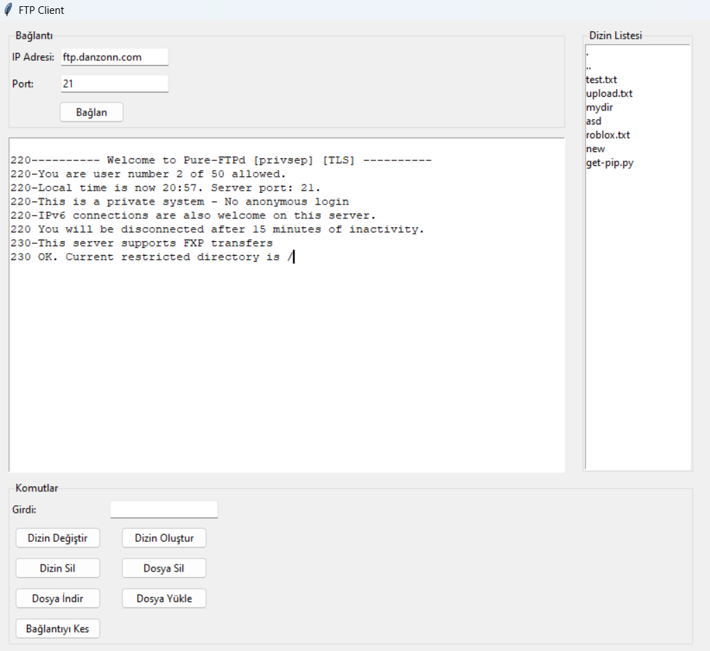

# Tkinter FTP Uygulaması

Bu proje, Python'un Tkinter kütüphanesi kullanılarak oluşturulmuş basit bir FTP (File Transfer Protocol) istemcisidir. Grafik arayüzü sayesinde FTP sunucularına kolayca bağlanabilir, dosya ve dizin işlemleri yapabilirsiniz.

## Özellikler

- FTP sunucusuna bağlanma ve giriş yapma
- Sunucudaki dizinleri listeleme
- Dizin değiştirme, oluşturma ve silme
- Dosya yükleme, indirme ve silme
- Kullanıcı dostu grafik arayüz (Tkinter)

## Gereksinimler

- Python 3.x
- Tkinter (genellikle Python ile birlikte gelir)
- ftplib (Python'un standart kütüphanesinde bulunur)

